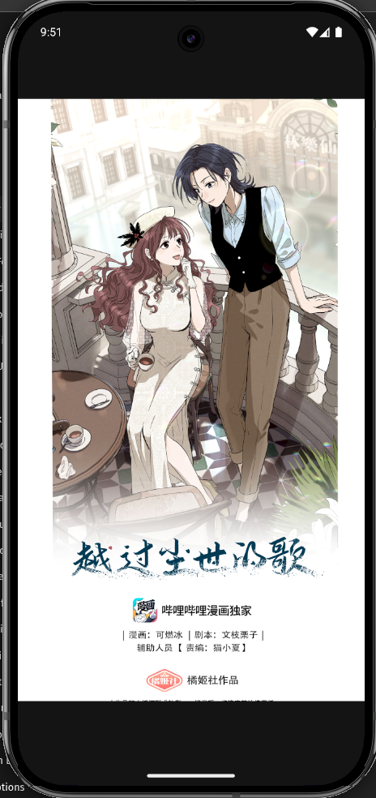
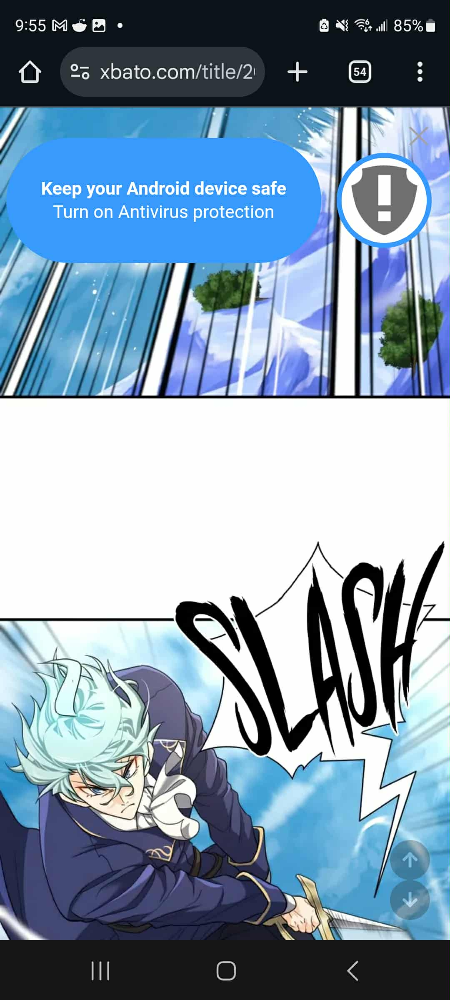

# Sprint 1 & 2 Presentation

---

# The Problems

---

## 1. A lot of readers read there favorite series in aggregator sites. Which means ...

---

## Pop up ADS!

- Tap or scroll, too much pop up ads that makes you go to another site or it is impossible to read

---

## 2. Majority of people read via phone and

- Browsers have address bar that are distracting

---

---

# There are already apps that exist in the Apps Store

---

# Pros

- Official English Translation

---

# But why do people still choose to read in aggregator sites?

- Official English Translation is slower to release new chapters
- Fan Group Translation is much more faster
- Sometimes lesser-known series doesn't get translated into English by Offical English Translation
- Fan Group Translation always pick up lesser-known series

---

# Here are three ways to read your series

- Wait for an Official English Translation
- Learn the Language
- Fan Group Translations

---

# Live Demo

---

# Sprint Summary

---

## Sprint 1

### Week 1 - Get list of manga for Home Screen

### Week 2 - Users can select a series and to be able to select and read a chapter

### Week 3 - Users can select a series and to be able to select and read a chapter(continuation)

### Week 4 - Users can add new series to ther library(finished only 50%)

---

## Sprint 2

### Week 1 - Finish up remaining requirements of Feature #4 and setup Library page

### Week 2 - Design Home Page & Detail Page UIs

### Week 3

- Users are able to change from light mode to dark mode download & import a library data and do an automatic backup(download) of library data with notifications
- Improve Chapter Page UI with vertical & horizontal scroll and prev & next chapter button
